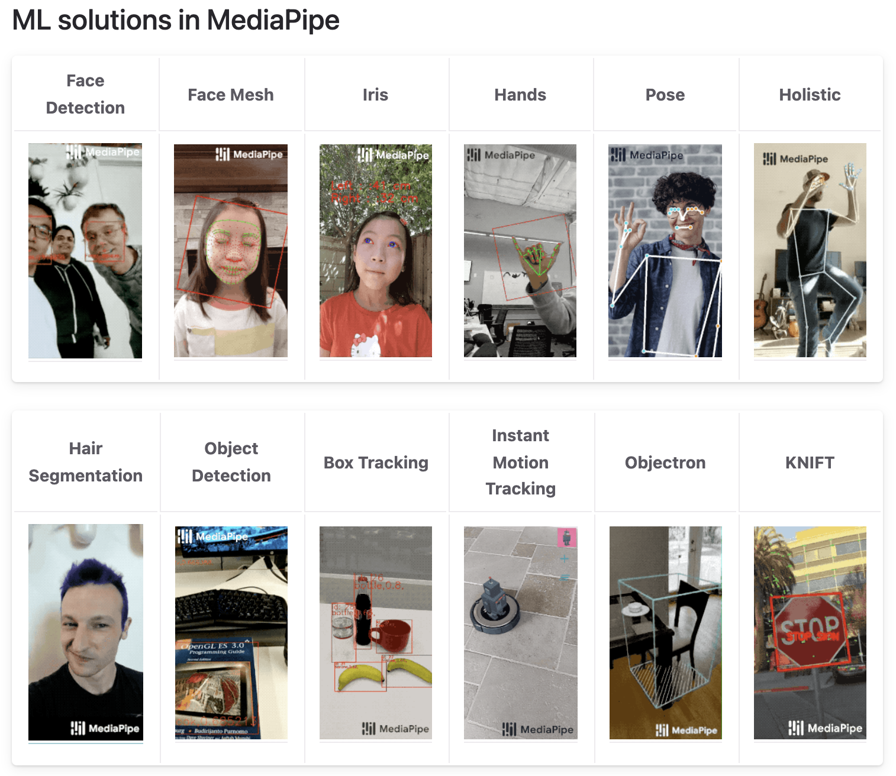

# インターンシップ2022 ワークショップ
## アプリケーションの開発業務を体感する、ソフトウェア開発コース  
## 業務体感型ワーク「シーズ発信の開発業務を体感！AIアプリをつくってみよう。」
<br>
<br>

# Pythonの超基本

## 0-1.まず、雑に動かします。  
下記のpyファイルを作成して、実行してみてください。  
  
001_add.py
```{r, attr.source='.numberLines'}
a = 1
b = 2

print(a+b)
```

## 0-2.標準入力を使う
下記のpyファイルを作成して、実行してみてください。  
  
002_add.py
```{r, attr.source='.numberLines'}
a = int(input("a = "))
b = int(input("b = "))

print("{} + {} = {}".format(a, b, a+b))
```

## 0-3.コマンドライン引数を使う
下記のpyファイルを作成して、実行してみてください。  
  
003_add.py
```{r, attr.source='.numberLines'}
import argparse

parser = argparse.ArgumentParser(description='2つの数字を足す')
parser.add_argument('a', type=int, help='１つ目の数字')
parser.add_argument('b', type=int, help='２つ目の数字')
args = parser.parse_args()

print("a = {}".format(args.a))
print("b = {}".format(args.b))
print("{} + {} = {}".format(args.a, args.b, args.a+args.b))
```

# MediaPipeを使ってみる
GoogleのオープンソースソフトウェアであるMediaPipeを使ってみます。  
プロジェクトページ  
https://google.github.io/mediapipe/  
Github  
https://github.com/google/mediapipe  



## 1-1. まず、ライセンスを確認する
オープンソースソフトウェアを使用する上で、初めに、ライセンスは確認するようにしてください。  
オープンソースソフトウェアは、ライセンス条項に従うことを条件に、自由に使って良いこととなっております。  
研究利用や商用利用が可能なものも多くあります。  
  
Google社は、下記のライセンスをもとに、MediaPipeの利用を認めております。  
### Apache-2.0 License
比較的利用条件の緩いライセンスで、商用利用可、改変・複製可、公開・再配布も可などが認められます。  
ただし、再配布する場合は、同じApache-2.0 Licenseで配布することが求められます。  
ライセンス条件は、下記を確認ください。  
https://www.apache.org/licenses/LICENSE-2.0  


## 1-2. mediapipeをインストールをする。
python3がインストールされている状態であれば、次のコマンドでインストールは完了です。
```
pip install mediapipe
```  
https://google.github.io/mediapipe/getting_started/python.html


## 1-3. サンプルコードを動かしてみる
オープンソースソフトウェアは、基本的に、サンプルのソースコードも公開されております。  
ハンドトラッキングの機能を動かしてみます。  
https://google.github.io/mediapipe/solutions/hands

004_handtracking_demo.py
```{r, attr.source='.numberLines'}
import cv2
import mediapipe as mp
mp_drawing = mp.solutions.drawing_utils
mp_drawing_styles = mp.solutions.drawing_styles
mp_hands = mp.solutions.hands


# For webcam input:
cap = cv2.VideoCapture(0)
with mp_hands.Hands(
    model_complexity=0,
    min_detection_confidence=0.5,
    min_tracking_confidence=0.5) as hands:
  while cap.isOpened():
    success, image = cap.read()
    if not success:
      print("Ignoring empty camera frame.")
      # If loading a video, use 'break' instead of 'continue'.
      continue

    # To improve performance, optionally mark the image as not writeable to
    # pass by reference.
    image.flags.writeable = False
    image = cv2.cvtColor(image, cv2.COLOR_BGR2RGB)
    results = hands.process(image)

    # Draw the hand annotations on the image.
    image.flags.writeable = True
    image = cv2.cvtColor(image, cv2.COLOR_RGB2BGR)
    if results.multi_hand_landmarks:
      for hand_landmarks in results.multi_hand_landmarks:
        mp_drawing.draw_landmarks(
            image,
            hand_landmarks,
            mp_hands.HAND_CONNECTIONS,
            mp_drawing_styles.get_default_hand_landmarks_style(),
            mp_drawing_styles.get_default_hand_connections_style())
    # Flip the image horizontally for a selfie-view display.
    cv2.imshow('MediaPipe Hands', cv2.flip(image, 1))
    if cv2.waitKey(5) & 0xFF == 27:
      break
cap.release()
```

動きました！超簡単！


## 1-3. 任意の手の座標情報を出力してみる。
mediapipeは、２つの座標系での座標情報を出力することが可能です。  

> ### MULTI_HAND_LANDMARKS
> Collection of detected/tracked hands, where each hand is represented as a list of 21 hand landmarks and each landmark is composed of x, y and z. x and y are normalized to [0.0, 1.0] by the image width and height respectively. z represents the landmark depth with the depth at the wrist being the origin, and the smaller the value the closer the landmark is to the camera. The magnitude of z uses roughly the same scale as x.

> ### MULTI_HAND_WORLD_LANDMARKS
> Collection of detected/tracked hands, where each hand is represented as a list of 21 hand landmarks in world coordinates. Each landmark is composed of x, y and z: real-world 3D coordinates in meters with the origin at the hand’s approximate geometric center.

それぞれの座標系における人差し指の座標情報を出力してみましょう。  

005_handtracking_outpur_landmark.py
```{r, attr.source='.numberLines'}
import cv2
import mediapipe as mp
mp_drawing = mp.solutions.drawing_utils
mp_drawing_styles = mp.solutions.drawing_styles
mp_hands = mp.solutions.hands


# For webcam input:
cap = cv2.VideoCapture(0)
with mp_hands.Hands(
    model_complexity=0,
    min_detection_confidence=0.5,
    min_tracking_confidence=0.5) as hands:
  while cap.isOpened():
    success, image = cap.read()
    if not success:
      print("Ignoring empty camera frame.")
      # If loading a video, use 'break' instead of 'continue'.
      continue

    # To improve performance, optionally mark the image as not writeable to
    # pass by reference.
    image.flags.writeable = False
    image = cv2.cvtColor(image, cv2.COLOR_BGR2RGB)
    results = hands.process(image)

    # Draw the hand annotations on the image.
    image.flags.writeable = True
    image = cv2.cvtColor(image, cv2.COLOR_RGB2BGR)
    if results.multi_hand_landmarks:
      for hand_landmarks in results.multi_hand_landmarks:
        mp_drawing.draw_landmarks(
            image,
            hand_landmarks,
            mp_hands.HAND_CONNECTIONS,
            mp_drawing_styles.get_default_hand_landmarks_style(),
            mp_drawing_styles.get_default_hand_connections_style())

    # Print hand world landmarks.
    if results.multi_hand_landmarks:
      for hand_landmarks in results.multi_hand_landmarks:
        print(
            f'x={hand_landmarks.landmark[mp_hands.HandLandmark.INDEX_FINGER_TIP].x}, '
            f'y={hand_landmarks.landmark[mp_hands.HandLandmark.INDEX_FINGER_TIP].y}, '
            f'z={hand_landmarks.landmark[mp_hands.HandLandmark.INDEX_FINGER_TIP].z}'
        )

    # Flip the image horizontally for a selfie-view display.
    cv2.imshow('MediaPipe Hands', cv2.flip(image, 1))
    if cv2.waitKey(5) & 0xFF == 27:
      break
cap.release()
```

006_handtracking_outpur_workd_landmark.py
```{r, attr.source='.numberLines'}
import cv2
import mediapipe as mp
mp_drawing = mp.solutions.drawing_utils
mp_drawing_styles = mp.solutions.drawing_styles
mp_hands = mp.solutions.hands


# For webcam input:
cap = cv2.VideoCapture(0)
with mp_hands.Hands(
    model_complexity=0,
    min_detection_confidence=0.5,
    min_tracking_confidence=0.5) as hands:
  while cap.isOpened():
    success, image = cap.read()
    if not success:
      print("Ignoring empty camera frame.")
      # If loading a video, use 'break' instead of 'continue'.
      continue

    # To improve performance, optionally mark the image as not writeable to
    # pass by reference.
    image.flags.writeable = False
    image = cv2.cvtColor(image, cv2.COLOR_BGR2RGB)
    results = hands.process(image)

    # Draw the hand annotations on the image.
    image.flags.writeable = True
    image = cv2.cvtColor(image, cv2.COLOR_RGB2BGR)
    if results.multi_hand_landmarks:
      for hand_landmarks in results.multi_hand_landmarks:
        mp_drawing.draw_landmarks(
            image,
            hand_landmarks,
            mp_hands.HAND_CONNECTIONS,
            mp_drawing_styles.get_default_hand_landmarks_style(),
            mp_drawing_styles.get_default_hand_connections_style())

    # Print hand world landmarks.
    if results.multi_hand_world_landmarks:
      for hand_world_landmarks in results.multi_hand_world_landmarks:
        print(
            f'x={hand_world_landmarks.landmark[mp_hands.HandLandmark.INDEX_FINGER_TIP].x}, '
            f'y={hand_world_landmarks.landmark[mp_hands.HandLandmark.INDEX_FINGER_TIP].y}, '
            f'z={hand_world_landmarks.landmark[mp_hands.HandLandmark.INDEX_FINGER_TIP].z}'
        )

    # Flip the image horizontally for a selfie-view display.
    cv2.imshow('MediaPipe Hands', cv2.flip(image, 1))
    if cv2.waitKey(5) & 0xFF == 27:
      break
cap.release()
```
２つの座標系の使い分けはイメージできますか？  
例えば、ジェスチャー認識をさせる場合は、ワールド座標系を用いた方が良さそうです。

## 1-4. ジェスチャー認識をさせてみましょう。
先ほど取得した人差し指座標を用いて、０と１を認識させてみましょう。  
0と１の違いは、どんなパラメータを用いて区別することができるでしょうか？

007_handtracking_outpur_gesture.py
```{r, attr.source='.numberLines'}
import cv2
import mediapipe as mp
import matplotlib.pyplot as plt
mp_drawing = mp.solutions.drawing_utils
mp_drawing_styles = mp.solutions.drawing_styles
mp_hands = mp.solutions.hands


class HistoryManager():

    def __init__(self):
        self.history = []
        self.num_history = 30

        # graph init
        plt.figure(figsize=(8, 8))
        self.ax = plt.subplot(1, 1, 1)
        self.ax.set_xlim([0, self.num_history])
        self.ax.set_ylim([0, 0.15])

    def update(self, v):
        """
        座標情報を最大格納数分だけ格納
        """
        self.history.append(v)
        if len(self.history) > self.num_history:
            self.history.pop(0)

    def plot(self):
        """
        グラフ描画（リアルタイム）
        """
        self.ax.cla()
        self.ax.plot([v for v in self.history])
        self.ax.set_xlim([0, self.num_history])
        self.ax.set_ylim([0, 0.15])
        plt.pause(0.01)
        

history_manager = HistoryManager()

# For webcam input:
cap = cv2.VideoCapture(0)
with mp_hands.Hands(
    model_complexity=0,
    min_detection_confidence=0.5,
    min_tracking_confidence=0.5) as hands:
  while cap.isOpened():
    success, image = cap.read()
    if not success:
      print("Ignoring empty camera frame.")
      # If loading a video, use 'break' instead of 'continue'.
      continue

    # To improve performance, optionally mark the image as not writeable to
    # pass by reference.
    image.flags.writeable = False
    image = cv2.cvtColor(image, cv2.COLOR_BGR2RGB)
    results = hands.process(image)

    # Draw the hand annotations on the image.
    image.flags.writeable = True
    image = cv2.cvtColor(image, cv2.COLOR_RGB2BGR)
    if results.multi_hand_landmarks:
      for hand_landmarks in results.multi_hand_landmarks:
        mp_drawing.draw_landmarks(
            image,
            hand_landmarks,
            mp_hands.HAND_CONNECTIONS,
            mp_drawing_styles.get_default_hand_landmarks_style(),
            mp_drawing_styles.get_default_hand_connections_style())

    # Print hand world landmarks.
    if results.multi_hand_world_landmarks:
      for hand_world_landmarks in results.multi_hand_world_landmarks:

        x = hand_world_landmarks.landmark[mp_hands.HandLandmark.INDEX_FINGER_TIP].x
        y = hand_world_landmarks.landmark[mp_hands.HandLandmark.INDEX_FINGER_TIP].y
        z = hand_world_landmarks.landmark[mp_hands.HandLandmark.INDEX_FINGER_TIP].z
        dist = (x**2 + y**2 + z**2)**(0.5)
        print(
            f'x={x}, '
            f'y={y}, '
            f'z={z}, '
            f'dist={dist}'
        )
        history_manager.update(dist)
        history_manager.plot()


    # Flip the image horizontally for a selfie-view display.
    cv2.imshow('MediaPipe Hands', cv2.flip(image, 1))
    if cv2.waitKey(5) & 0xFF == 27:
      break
cap.release()
```

人差し指とワールド座標系の中心(0, 0, 0)の距離に着目すれば、  
１と０の区別はできそうだとわかりました。  
閾値を決めてジェスチャーを出力してみましょう！

008_handtracking_outpur_gesture.py
```{r, attr.source='.numberLines'}
import cv2
import mediapipe as mp
mp_drawing = mp.solutions.drawing_utils
mp_drawing_styles = mp.solutions.drawing_styles
mp_hands = mp.solutions.hands


# For webcam input:
cap = cv2.VideoCapture(0)
with mp_hands.Hands(
    model_complexity=0,
    min_detection_confidence=0.5,
    min_tracking_confidence=0.5) as hands:
  while cap.isOpened():
    success, image = cap.read()
    if not success:
      print("Ignoring empty camera frame.")
      # If loading a video, use 'break' instead of 'continue'.
      continue

    # To improve performance, optionally mark the image as not writeable to
    # pass by reference.
    image.flags.writeable = False
    image = cv2.cvtColor(image, cv2.COLOR_BGR2RGB)
    results = hands.process(image)

    # Draw the hand annotations on the image.
    image.flags.writeable = True
    image = cv2.cvtColor(image, cv2.COLOR_RGB2BGR)
    if results.multi_hand_landmarks:
      for hand_landmarks in results.multi_hand_landmarks:
        mp_drawing.draw_landmarks(
            image,
            hand_landmarks,
            mp_hands.HAND_CONNECTIONS,
            mp_drawing_styles.get_default_hand_landmarks_style(),
            mp_drawing_styles.get_default_hand_connections_style())

    # Print hand world landmarks.
    if results.multi_hand_world_landmarks:
      for hand_world_landmarks in results.multi_hand_world_landmarks:

        x = hand_world_landmarks.landmark[mp_hands.HandLandmark.INDEX_FINGER_TIP].x
        y = hand_world_landmarks.landmark[mp_hands.HandLandmark.INDEX_FINGER_TIP].y
        z = hand_world_landmarks.landmark[mp_hands.HandLandmark.INDEX_FINGER_TIP].z
        dist = (x**2 + y**2 + z**2)**(0.5)

        gesture = "1" if dist > 0.06 else 0
         
        print(
            f'gesuture={gesture}, '
            f'dist={dist}'
        )

    # Flip the image horizontally for a selfie-view display.
    cv2.imshow('MediaPipe Hands', cv2.flip(image, 1))
    if cv2.waitKey(5) & 0xFF == 27:
      break
cap.release()
```

## 1-5. ハンドトラッキングの理論を確認してみましょう。
下記に本件に関する文献のURLを貼っておきます。  
興味があれば、確認してみてください！  
https://arxiv.org/abs/2006.10214  
https://www.youtube.com/watch?v=I-UOrvxxXEk

<br>
<br>
<br>
***
時間があれば、他の機能もサンプルコードを見ながら動かしてみてください。
